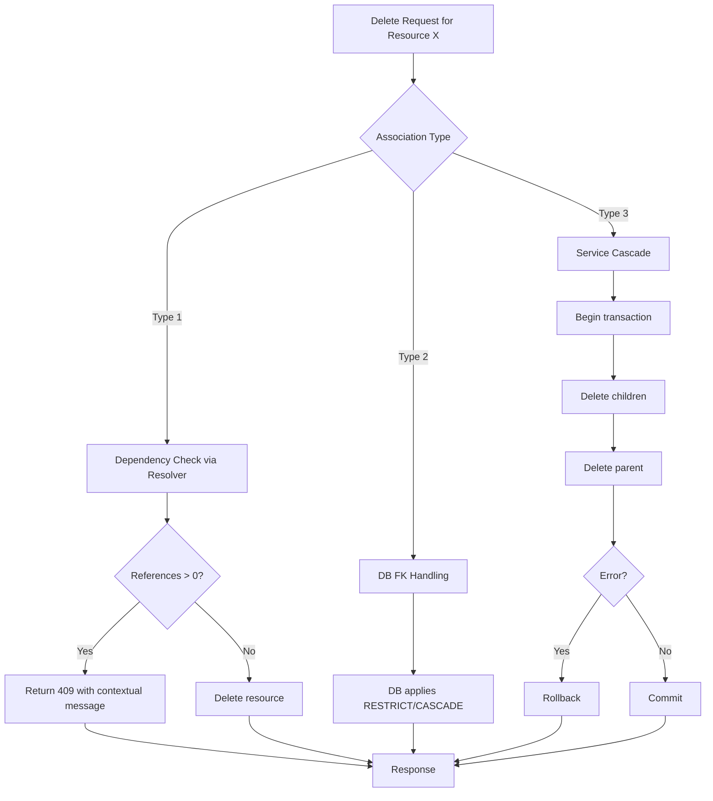
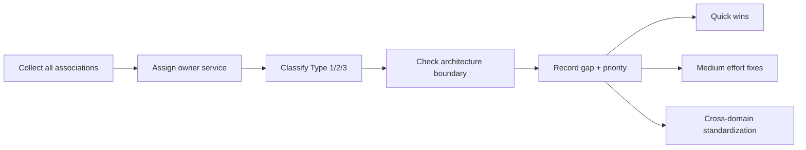
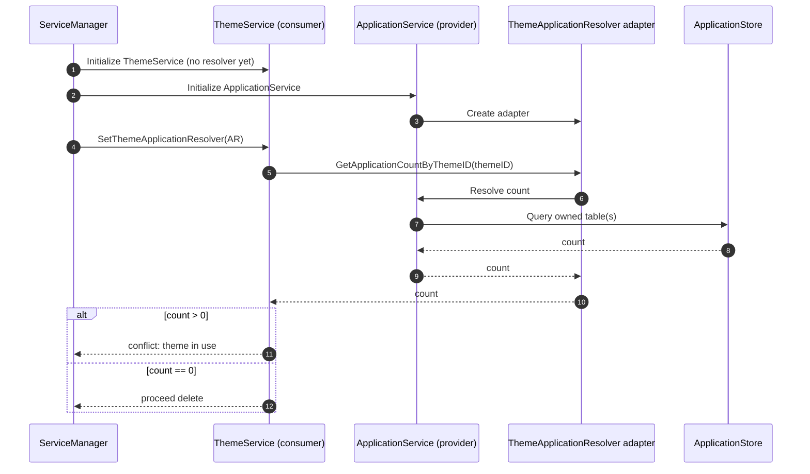

# Thunder Deletion Management
## Architecture Plan with Examples, Diagrams, and Current Status

## 1. Executive Summary

Thunder currently has mixed deletion behavior across domains:
- Some deletions correctly fail when references exist.
- Some rely on DB cascades.
- Some require service-level cleanup but are incomplete.
- A few checks violate architecture boundaries (cross-domain table access from the wrong package).

This proposal standardizes deletion management with:
1. Type 1: Fail deletion with contextual messages.
2. Type 2: DB-level integrity/cascade where applicable.
3. Type 3: Service-level cascades for cross-domain/runtime data.

And one non-negotiable architecture rule:

> A package store can query only its own domain tables. Cross-domain checks must use resolver/service interfaces.

---

## 2. Why This Change Is Needed

### Current issues
- Inconsistent user experience (generic errors vs actionable messages).
- Incomplete cleanup paths (orphaned references in some flows).
- Coupling risk from cross-domain SQL in consumer packages.
- Harder maintenance and higher regression risk.

### Desired outcomes
- Predictable deletion behavior by association type.
- Strong domain boundaries.
- Atomic, testable cascades.
- Clear API conflict responses users can act on.

---

## 3. Core Deletion Model

### Type 1: Fail Deletion
If dependencies exist, reject deletion with context.

Example message:
- "Cannot delete theme. It is used by 3 applications."

### Type 2: Database-Enforced
Use FK constraints (`RESTRICT`, `CASCADE`) where data is naturally relational and local.

### Type 3: Service Cascade
When FK is not suitable (cross-domain/runtime/temporary data), cleanup in service layer inside a transaction.

### 3.1 Two Separate Usage-Check Scenarios

Usage checks must be treated as two separate flows.

1. Child delete check
- Trigger: deleting a child/dependent resource.
- Question: "Is this child still referenced by any parent or owner?"
- Typical behavior: Type 1 fail-delete with contextual count.
- Example: delete FLOW -> block if APPLICATION references it via auth_flow_id or registration_flow_id.

2. Parent delete check
- Trigger: deleting a parent/aggregate resource.
- Question: "Do child/dependent resources still exist under this parent?"
- Typical behavior: Type 1 fail-delete or Type 3 service cascade, depending on policy.
- Example: delete ORGANIZATION_UNIT -> block/cascade based on child OUs, users, groups, roles, schemas, resource servers.

These two checks are not interchangeable:
- Child delete checks protect inbound references to the child.
- Parent delete checks protect descendants and owned associations under the parent.

### 3.2 Interface Direction by Scenario

To avoid coupling and keep ownership clear, interface ownership changes by scenario.

1. Scenario A: child delete check (inbound reference check)
- Interface owner: child package (the package making the delete decision).
- Implementation owner: parent/owner package that stores references.
- Example: Theme delete asks Application package for usage count.

```go
// child package (theme)
type ThemeUsageResolver interface {
    GetApplicationCountByThemeID(ctx context.Context, themeID string) (int, error)
}
```

2. Scenario B: parent delete check (descendant/dependent check)
- Interface owner: parent package (the aggregate being deleted).
- Implementation owner: child/dependent package.
- Example: OU delete asks User package for user count under OU.

```go
// parent package (ou)
type OUUserDependencyResolver interface {
    GetUserCountByOU(ctx context.Context, ouID string) (int, error)
}
```

Naming guidance:
- Prefer count/existence methods for delete decisions (`Get*Count*`, `Has*`).
- Avoid bulk fetch signatures for deletion checks unless IDs are strictly required.

### 3.3 Scenario A example code (child delete check)

This example shows a child service (Theme) blocking delete when still referenced by parent-owned data (Application).

```go
// thememgt package (child, delete decision owner)
type ThemeUsageResolver interface {
    GetApplicationCountByThemeID(ctx context.Context, themeID string) (int, error)
}

type themeMgtService struct {
    themeStore themeMgtStoreInterface
    usage      ThemeUsageResolver
}

func (ts *themeMgtService) DeleteTheme(ctx context.Context, themeID string) *serviceerror.ServiceError {
    count, err := ts.usage.GetApplicationCountByThemeID(ctx, themeID)
    if err != nil {
        return &serviceerror.InternalServerError
    }

    if count > 0 {
        e := ErrorThemeInUse
        e.ErrorDescription = fmt.Sprintf("Cannot delete theme. It is used by %d application(s)", count)
        return &e
    }

    if err := ts.themeStore.DeleteTheme(themeID); err != nil {
        return &serviceerror.InternalServerError
    }
    return nil
}

// application package (parent, implementation owner)
func (as *applicationService) GetApplicationCountByThemeID(ctx context.Context, themeID string) (int, error) {
    return as.appStore.GetApplicationCountByThemeID(ctx, themeID)
}
```

### 3.4 Scenario B example code (parent delete check)

This example shows a parent service (OU) checking dependent child resources before delete.

```go
// ou package (parent, delete decision owner)
type OUUserDependencyResolver interface {
    GetUserCountByOU(ctx context.Context, ouID string) (int, error)
}

type ouService struct {
    ouStore   ouStoreInterface
    userUsage OUUserDependencyResolver
}

func (os *ouService) DeleteOU(ctx context.Context, ouID string) *serviceerror.ServiceError {
    userCount, err := os.userUsage.GetUserCountByOU(ctx, ouID)
    if err != nil {
        return &serviceerror.InternalServerError
    }

    if userCount > 0 {
        e := ErrorOUInUse
        e.ErrorDescription = fmt.Sprintf("Cannot delete organization unit. It has %d user(s)", userCount)
        return &e
    }

    if err := os.ouStore.DeleteOU(ctx, ouID); err != nil {
        return &serviceerror.InternalServerError
    }
    return nil
}

// user package (child, implementation owner)
func (us *userService) GetUserCountByOU(ctx context.Context, ouID string) (int, error) {
    return us.userStore.GetUserCountByOU(ctx, ouID)
}
```

---

## 4. High-Level Architecture Diagram



---

## 5. Phase 1: Inventory and Classification

Phase 1 produces a policy matrix of all associations:
- Parent resource
- Dependent resource
- Deletion type (1/2/3)
- Owner service
- Current behavior
- Gap

### Phase 1 diagram



### Example gaps identified
- Theme/Layout check application usage via direct table query from consumer package.
- Some delete paths return generic conflicts without counts.
- Some service-cascade relations are missing, causing orphaned data.

---

## 6. Current Implementation Status Matrix (Type 1/2/3)

Status legend:
- Implemented
- Partial
- Not implemented
- Needs architecture fix

| Parent delete | Dependent resource | Type | Expected behavior | Current status |
|---|---|---:|---|---|
| ORGANIZATION_UNIT | PARENT_ORGANIZATION_UNIT | 1 | Fail delete if child OUs exist | Implemented |
| ORGANIZATION_UNIT | USER | 1 | Fail delete if users exist | Implemented |
| ORGANIZATION_UNIT | GROUP | 1 | Fail delete if groups exist | Implemented |
| ORGANIZATION_UNIT | USER_SCHEMAS | 1 | Fail delete if schemas exist | Not implemented |
| ORGANIZATION_UNIT | ROLE | 1 | Fail delete if roles exist | Not implemented |
| ORGANIZATION_UNIT | RESOURCE_SERVER | 3 | Service cascade delete of child resource servers | Not implemented |
| USER_SCHEMAS | USER attributes | 1 | Fail delete if schema is referenced | Not implemented |
| USER_SCHEMAS | APPLICATION attributes | 1 | Fail delete if schema is referenced | Not implemented |
| ROLE | ROLE_ASSIGNMENT | 1 + 2 | Block by service if assigned; role-owned rows cascade | Partial |
| ROLE | ROLE_PERMISSION | 2 | DB cascade | Implemented |
| THEME | APPLICATION | 1 | Fail delete with usage count | Needs architecture fix |
| LAYOUT | APPLICATION | 1 | Fail delete with usage count | Needs architecture fix |
| APPLICATION | APP_OAUTH_INBOUND_CONFIG | 2 | DB cascade | Implemented |
| APPLICATION | CERTIFICATE | 3 | Service cascade | Implemented |
| APPLICATION | FLOW_CONTEXT | 3 | Service cascade on app delete | Not implemented |
| FLOW | FLOW_VERSION | 2 | DB cascade | Implemented |
| FLOW | APPLICATION auth_flow_id | 1 | Fail flow delete when referenced | Not implemented |
| FLOW | APPLICATION registration_flow_id | 1 | Fail flow delete when referenced | Not implemented |
| IDP | FLOW references | 1 | Fail IDP delete if used in flows | Not implemented |
| NOTIFICATION_SENDER | FLOW references | 1 | Fail sender delete if used in flows | Not implemented |
| RESOURCE_SERVER | RESOURCE | 1 | Fail delete if resources exist | Implemented (generic error) |
| RESOURCE_SERVER | ACTION | 1 | Fail delete if actions exist | Implemented (generic error) |
| RESOURCE_SERVER | ROLE_PERMISSION | 1 | Fail delete if role permissions exist | Not implemented |
| RESOURCE | PARENT_RESOURCE children | 1 | Fail delete if child resources exist | Implemented (generic error) |
| RESOURCE | ACTION (resource-level) | 1 | Fail delete if actions exist | Implemented (generic error) |
| USER | ROLE_ASSIGNMENT | 3 | Service cascade cleanup on user delete | Not implemented |
| USER | GROUP_MEMBER_REFERENCE | 3 | Service cascade cleanup on user delete | Not implemented |
| USER | WEBAUTHN_SESSION | 3 | Service cascade cleanup on user delete | Not implemented |
| USER | FLOW_USER_DATA | 3 | Service cascade cleanup on user delete | Not implemented |
| GROUP | GROUP_MEMBER_REFERENCE | 3 | Service cleanup on group delete | Implemented |
| GROUP | ROLE_ASSIGNMENT | 3 | Service cleanup on group delete | Not implemented |

### Status summary by type

- Type 1:
  - Implemented in key places (OU child/users/groups, Theme/Layout, Resource/ResourceServer, Role).
  - Gaps remain in flow-reference checks, IDP/notification references, and some OU/user-schema related checks.
  - Several implemented paths still need contextual counts in error descriptions.

- Type 2:
  - Core FK cascades/restricts are already in place and working for role permissions/assignments, app OAuth config, flow versions, and flow-user-data via flow-context.

- Type 3:
  - Implemented in a few places (application certificate cleanup, group-member cleanup on group delete).
  - Major gaps remain for user/group-related cleanup and application-to-flow-context cleanup.

---

## 7. Phase 4: Cross-Domain Contract Standardization

Phase 4 is where we remove architecture violations.

### 7.1 Principle
Consumer service defines a small resolver interface for what it needs.
Provider service implements it.
Service manager wires them after both are initialized (two-phase init).

For Application-owned dependency checks, use a single generic contract:

```go
type ResourceType string

const (
    ResourceTypeTheme  ResourceType = "theme"
    ResourceTypeLayout ResourceType = "layout"
    ResourceTypeFlow   ResourceType = "flow"
)

type DependencyResolver interface {
    GetCountByResource(ctx context.Context, resourceType ResourceType, resourceID string) (int, error)
}
```

This keeps `ApplicationService` minimal and avoids adding one method per resource relationship.

Important: this generic contract is for Scenario A (child delete checks for Application-owned references such as Theme/Layout/Flow). For Scenario B (parent delete checks like OU), use explicit typed resolver interfaces owned by the parent package.

### 7.1.1 Existing resolver examples already in Thunder

Thunder already uses explicit resolver injection for Scenario B style parent-delete/read cases.

| Resolver | Implementing package | Use case | Scenario |
|---|---|---|---|
| OUUserResolver | user | OU deletion checks + read | Scenario B (parent delete) + user listing |
| OUGroupResolver | group | OU deletion checks + read | Scenario B (parent delete) + group listing |

What these show:
- The interface is owned by the parent domain (`ou`).
- The implementation is provided by the child/dependent domain (`user`, `group`).
- Resolver instances are created during child service initialization and injected later by service manager.
- The same resolver can serve both delete validation and read/listing use cases without breaking domain boundaries.

Sample interface in parent package:

```go
// ou package
type OUUserResolver interface {
    GetUserCountByOUID(ctx context.Context, ouID string) (int, error)
    GetUserListByOUID(ctx context.Context, ouID string, limit, offset int, includeDisplay bool) ([]User, error)
}

type OUGroupResolver interface {
    GetGroupCountByOUID(ctx context.Context, ouID string) (int, error)
    GetGroupListByOUID(ctx context.Context, ouID string, limit, offset int) ([]Group, error)
}
```

Sample implementation in child package:

```go
// user package
type ouUserResolverAdapter struct {
    store             userStoreInterface
    userSchemaService userschema.UserSchemaServiceInterface
}

func newOUUserResolver(
    store userStoreInterface,
    userSchemaService userschema.UserSchemaServiceInterface,
) oupkg.OUUserResolver {
    return &ouUserResolverAdapter{store: store, userSchemaService: userSchemaService}
}

func (a *ouUserResolverAdapter) GetUserCountByOUID(ctx context.Context, ouID string) (int, error) {
    return a.store.GetUserListCountByOUIDs(ctx, []string{ouID}, nil)
}
```

```go
// group package
type ouGroupResolverAdapter struct {
    store groupStoreInterface
}

func newOUGroupResolver(store groupStoreInterface) oupkg.OUGroupResolver {
    return &ouGroupResolverAdapter{store: store}
}

func (a *ouGroupResolverAdapter) GetGroupCountByOUID(ctx context.Context, ouID string) (int, error) {
    return a.store.GetGroupsByOrganizationUnitCount(ctx, ouID)
}
```

Sample creation and injection flow:

```go
// user.Initialize(...)
ouUserResolver := newOUUserResolver(userStore, userSchemaService)
return userService, ouUserResolver, exporter, nil

// group.Initialize(...)
ouGroupResolver := newOUGroupResolver(groupStore)
return groupService, ouGroupResolver, nil

// service manager
ouService.SetOUUserResolver(ouUserResolver)
ouService.SetOUGroupResolver(ouGroupResolver)
```

Sample usage in parent delete flow:

```go
func (ous *organizationUnitService) deleteOUInternal(
    ctx context.Context,
    id string,
    logger *log.Logger,
) *serviceerror.ServiceError {
    userCount, err := ous.userResolver.GetUserCountByOUID(ctx, id)
    if err != nil {
        return &ErrorInternalServerError
    }
    if userCount > 0 {
        return &ErrorCannotDeleteOrganizationUnit
    }

    groupCount, err := ous.groupResolver.GetGroupCountByOUID(ctx, id)
    if err != nil {
        return &ErrorInternalServerError
    }
    if groupCount > 0 {
        return &ErrorCannotDeleteOrganizationUnit
    }

    return nil
}
```

### 7.1.2 Resolver unavailable policy

Resolvers may be unavailable due to missing wiring or runtime errors. The delete path must fail safely.

Policy:
1. Startup: required resolvers must be validated; fail startup when missing.
2. Runtime Type 1 checks: if resolver is nil or returns error, return `InternalServerError` — never skip silently.
3. Runtime Type 3 cascades: rollback transaction on any cascade failure.

Example guard:

```go
if ous.userResolver == nil {
    return &ErrorInternalServerError
}
userCount, err := ous.userResolver.GetUserCountByOUID(ctx, id)
if err != nil {
    return &ErrorInternalServerError
}
if userCount > 0 {
    return &ErrorCannotDeleteOrganizationUnit
}
```

### 7.1.3 Cyclic dependency check (especially for Type 3)

When adding Type 3 cascades or validation resolvers, verify dependency direction before wiring:

1. Package-level imports must remain acyclic.
- Domain packages depend on interfaces, not on each other's concrete services.
- Concrete wiring happens only in service manager/init layer.

2. Runtime call graph must avoid recursive delete/validate loops.
- Avoid bidirectional orchestration (A delete calls B delete while B delete calls A delete).
- Keep one orchestrator for a cascade path.

3. Validation dependencies must follow the same interface rule.
- Example: Application create/update validates theme/layout IDs via resolver/provider contract, not direct cross-domain store query.
- This prevents validation logic from reintroducing the same cycle that delete logic removed.

Practical check list before merge:
- `go list` / build confirms no import cycles.
- Service manager wiring is one-directional and explicit.
- Delete and validation paths do not call each other recursively across domains.

### 7.2 Sequence diagram (Phase 4 only)



---

## 8. Code Example: Consumer Contract (Theme with generic DependencyResolver)

```go
package thememgt

import "context"

type ThemeApplicationResolver interface {
    GetCountByResource(ctx context.Context, resourceType ResourceType, resourceID string) (int, error)
}

type ResourceType string

const (
    ResourceTypeTheme ResourceType = "theme"
)

type ConfigurableThemeMgtService interface {
    ThemeMgtServiceInterface
    SetThemeApplicationResolver(resolver ThemeApplicationResolver)
    ValidateDependencies() error
}

type themeMgtService struct {
    themeMgtStore       themeMgtStoreInterface
    applicationResolver ThemeApplicationResolver
}

func (ts *themeMgtService) SetThemeApplicationResolver(resolver ThemeApplicationResolver) {
    ts.applicationResolver = resolver
}

func (ts *themeMgtService) ValidateDependencies() error {
    if ts.applicationResolver == nil {
        return errors.New("theme application resolver is not configured")
    }
    return nil
}
```

### Delete flow with resolver

```go
func (ts *themeMgtService) DeleteTheme(ctx context.Context, id string) *serviceerror.ServiceError {
    // ...validate id and existence...

    count, err := ts.applicationResolver.GetCountByResource(ctx, ResourceTypeTheme, id)
    if err != nil {
        return &serviceerror.InternalServerError
    }

    if count > 0 {
        err := ErrorThemeInUse
        err.ErrorDescription = fmt.Sprintf("This theme is used by %d application(s)", count)
        return &err
    }

    if err := ts.themeMgtStore.DeleteTheme(id); err != nil {
        return &serviceerror.InternalServerError
    }
    return nil
}
```

---

## 9. Code Example: Provider Implementation (Application with single generic function)

```go
package application

type ResourceType string

const (
    ResourceTypeTheme  ResourceType = "theme"
    ResourceTypeLayout ResourceType = "layout"
    ResourceTypeFlow   ResourceType = "flow"
)

var ErrUnsupportedResourceType = errors.New("unsupported resource type")

func (as *applicationService) GetCountByResource(
    ctx context.Context,
    resourceType ResourceType,
    resourceID string,
) (int, error) {
    switch resourceType {
    case ResourceTypeTheme:
        return as.appStore.GetApplicationCountByThemeID(ctx, resourceID)
    case ResourceTypeLayout:
        return as.appStore.GetApplicationCountByLayoutID(ctx, resourceID)
    case ResourceTypeFlow:
        return as.appStore.GetApplicationCountByFlowID(ctx, resourceID)
    default:
        return 0, ErrUnsupportedResourceType
    }
}
```

### Store method in provider domain only

```go
func (st *applicationStore) GetApplicationCountByThemeID(
    ctx context.Context,
    themeID string,
) (int, error) {
    results, err := dbClient.QueryContext(ctx, queryGetApplicationCountByThemeID, themeID, st.deploymentID)
    if err != nil {
        return 0, err
    }
    return parseCount(results)
}

func (st *applicationStore) GetApplicationCountByLayoutID(
    ctx context.Context,
    layoutID string,
) (int, error) {
    results, err := dbClient.QueryContext(ctx, queryGetApplicationCountByLayoutID, layoutID, st.deploymentID)
    if err != nil {
        return 0, err
    }
    return parseCount(results)
}

func (st *applicationStore) GetApplicationCountByFlowID(
    ctx context.Context,
    flowID string,
) (int, error) {
    results, err := dbClient.QueryContext(ctx, queryGetApplicationCountByFlowID, flowID, flowID, st.deploymentID)
    if err != nil {
        return 0, err
    }
    return parseCount(results)
}
```

---

## 10. Code Example: Service Manager Wiring (Two-Phase)

```go
func registerServices(mux *http.ServeMux) {
    themeSvc, _, err := thememgt.Initialize(mux)
    if err != nil {
        logger.Fatal("Failed to initialize theme service", log.Error(err))
    }

    layoutSvc, _, err := layoutmgt.Initialize(mux)
    if err != nil {
        logger.Fatal("Failed to initialize layout service", log.Error(err))
    }

    appSvc, _, err := application.Initialize(
        mux,
        mcpServer,
        certService,
        flowMgtService,
        themeSvc,
        layoutSvc,
        userSchemaService,
        consentService,
    )
    if err != nil {
        logger.Fatal("Failed to initialize application service", log.Error(err))
    }

    configurableThemeSvc, ok := themeSvc.(thememgt.ConfigurableThemeMgtService)
    if !ok {
        logger.Fatal("Theme service missing configurable interface")
    }
    configurableThemeSvc.SetThemeApplicationResolver(appSvc)

    configurableLayoutSvc, ok := layoutSvc.(layoutmgt.ConfigurableLayoutMgtService)
    if !ok {
        logger.Fatal("Layout service missing configurable interface")
    }
    configurableLayoutSvc.SetLayoutApplicationResolver(appSvc)

    if err := configurableThemeSvc.ValidateDependencies(); err != nil {
        logger.Fatal("Theme dependencies invalid", log.Error(err))
    }
    if err := configurableLayoutSvc.ValidateDependencies(); err != nil {
        logger.Fatal("Layout dependencies invalid", log.Error(err))
    }
}
```

### 10.1 Validation dependency example (create/update path)

Deletion is not the only cross-domain dependency. Validation uses the same boundary rule.

Example: during Application create/update, Theme/Layout IDs must be validated through a resolver contract owned by Application (consumer), implemented by Theme/Layout providers.

```go
// application package (consumer)
type ThemeValidationResolver interface {
    ExistsTheme(ctx context.Context, themeID string) (bool, error)
}

type LayoutValidationResolver interface {
    ExistsLayout(ctx context.Context, layoutID string) (bool, error)
}

func (as *applicationService) validateThemeAndLayout(
    ctx context.Context,
    themeID,
    layoutID string,
) *serviceerror.ServiceError {
    if themeID != "" {
        exists, err := as.themeValidationResolver.ExistsTheme(ctx, themeID)
        if err != nil {
            return &serviceerror.InternalServerError
        }
        if !exists {
            return &serviceerror.ErrorInvalidRequest
        }
    }

    if layoutID != "" {
        exists, err := as.layoutValidationResolver.ExistsLayout(ctx, layoutID)
        if err != nil {
            return &serviceerror.InternalServerError
        }
        if !exists {
            return &serviceerror.ErrorInvalidRequest
        }
    }

    return nil
}
```

This keeps validation decoupled and consistent with delete-path architecture.

---

## 11. Type 3 Service Cascade Example

For relations that need service-managed cleanup:

```go
func (us *userService) DeleteUser(ctx context.Context, userID string) *serviceerror.ServiceError {
    err := us.transactioner.Transact(ctx, func(txCtx context.Context) error {
        if err := us.roleResolver.DeleteAssignmentsByUserID(txCtx, userID); err != nil {
            return err
        }
        if err := us.groupResolver.DeleteMembershipsByUserID(txCtx, userID); err != nil {
            return err
        }
        if err := us.flowResolver.DeleteRuntimeByUserID(txCtx, userID); err != nil {
            return err
        }
        return us.userStore.DeleteUser(txCtx, userID)
    })

    if err != nil {
        return &serviceerror.InternalServerError
    }
    return nil
}
```

This ensures atomicity: all related cleanup succeeds together, or all of it rolls back.

---

## 12. Rollout Plan (Aligned to Current Status)

### Wave A (quick wins)
- Theme/Layout resolver migration (architecture fix).
- Add contextual counts to existing Type 1 generic errors (Role, Resource, ResourceServer, OU).
- Add missing Type 1 checks for flow references from applications.

### Wave B
- Implement Type 3 cascades for user and group cleanup gaps:
- User -> role assignments
- User -> group memberships
- User -> runtime artifacts (flow/session related)
- Group -> role assignments

### Wave C
- OU and flow ecosystem alignment:
- OU -> user schemas/roles checks
- IDP/notification sender reference checks in flow usage
- Application -> flow context cleanup path

### Wave D
- Integration hardening + regression sweep + DB parity validation.

---

## 13. Test Strategy

1. Unit tests (consumer)
- Resolver count > 0 returns conflict with exact message.
- Resolver errors map to internal errors.

2. Unit tests (provider)
- Count methods return expected values and error handling.

3. Wiring tests
- Service manager initializes and injects resolvers correctly.

4. Integration tests
- In-use resource deletion blocked with context.
- Service-cascade paths clean child data atomically.

5. Architecture guard
- Add a grep-based check to detect foreign table names in consumer stores.

---

## 14. Presentation Talking Points

1. "We classify every delete association into Type 1, 2, or 3 and track implementation status."
2. "Type 2 is mostly healthy; the biggest risk is Type 3 gaps and boundary violations in Type 1 checks."
3. "Theme/Layout are our first architecture-correction targets: resolver-based checks, no cross-domain SQL."
4. "We use two-phase service wiring to avoid import cycles."
5. "After Wave B and C, deletions become predictable, safer, and easier to maintain."

---

## 15. Definition of Done

- Status matrix exists and is kept up to date per release.
- No direct APPLICATION table queries in Theme/Layout stores.
- Cross-domain delete checks implemented via resolver interfaces.
- Contextual conflict errors for Type 1 paths.
- Atomic transaction semantics for Type 3 paths.
- Unit/integration tests updated and passing.
- Documentation updated for architecture governance.
